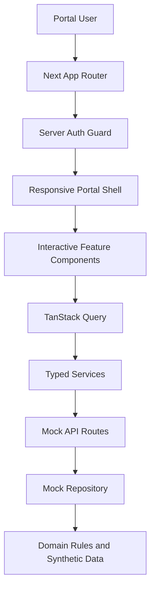

# Architecture

The app uses Next.js App Router with Server Components by default. Server layouts enforce authentication before rendering protected areas, and client components are used for interactive search, filtering, cart, checkout, account CRUD, notifications, and tables.

Server state belongs in TanStack Query, URL state belongs in search parameters, component interaction belongs in React state, and the cart/recent searches use small persisted client stores only where cross-route continuity is required.

The dashboard performs server-side initial data loading, then hands that payload to TanStack Query as initial data. Additional detail/list routes can use the same pattern when connected to a real backend with cache tags and request-scoped auth.
